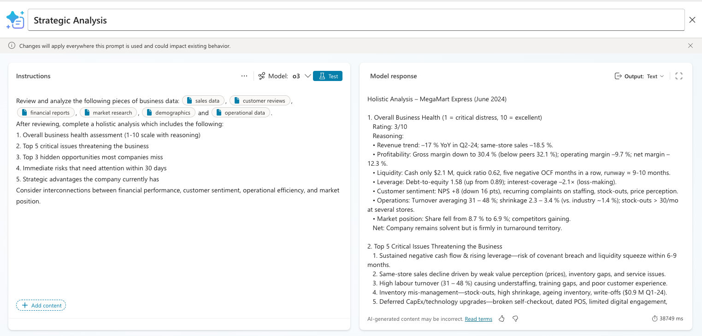

# Strategic Company Analysis

## Description

This prompt utilizes the power of the o3 model to perform a strategic analysis of your business. It takes into account sales data, demographics, customer reviews, financial reports, operational data and market demographics in the analysis.

## Prompt

Review and analyze the following pieces of business data: [sales data], [customer reviews], [financial reports], [market research], [demographics] and [operational data].
After reviewing, complete a holistic analysis which includes the following:

1. Overall business health assessment (1-10 scale with reasoning)
2. Top 5 critical issues threatening the business
3. Top 3 hidden opportunities most companies miss
4. Immediate risks that need attention within 30 days
5. Strategic advantages the company currently has
Consider interconnections between financial performance, customer sentiment, operational efficiency, and market position.

### Supported Language(s)

[English](./en-us/prompt.md)

## Authors

Solution|Author(s)
--------|---------
Strategic Company Analysis | [April Dunnam](https://github.com/aprildunnam) ([@aprildunnam](https://twitter.com/aprildunnam)), Microsoft

## Minimal Path to Awesome

* Copy the prompt
* Create a new AI Builder Prompt and paste in the prompt
* Replace anything in brackets [] with image/document inputs
* Optional: Use the following sample data to test the prompt
    * [Sales Data](./assets/salesdata.pdf)
    * [Operational Data](./assets/operationaldata.pdf)
    * [Market Research](./assets/market_research.pdf)
    * [Financial Reports](./assets/financial_reports.pdf)
    * [Demographics](./assets/demographicsdata.pdf)
    * [Reviews](./assets/feedback.pdf)

## Disclaimer

**THIS CODE IS PROVIDED *AS IS* WITHOUT WARRANTY OF ANY KIND, EITHER EXPRESS OR IMPLIED, INCLUDING ANY IMPLIED WARRANTIES OF FITNESS FOR A PARTICULAR PURPOSE, MERCHANTABILITY, OR NON-INFRINGEMENT.**

