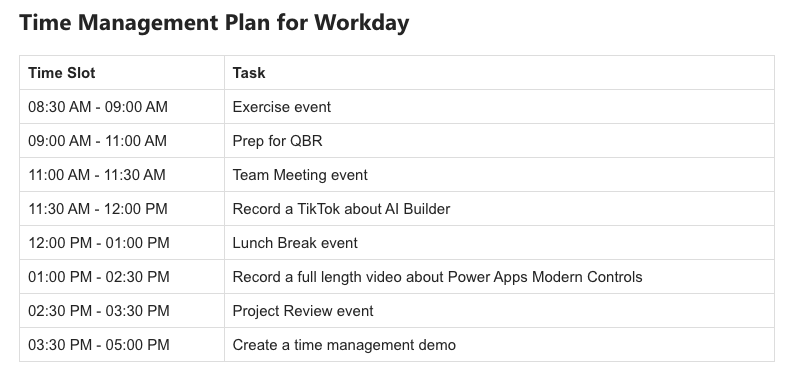

# Time Management Plan

## Description

Designs a schedule to optimize time usage

## Prompt

Create a time management plan for a workday, given these tasks and priorities [priorities] . Take into account the meetings already in place for the day [meetings] and display a breakdown of focus allocations by time. Format response as HTML.

## Additional Info

To see how to use this prompt in Power Automate to get a daily time blocking scheduling based on your tasks and events, check out [this video](https://youtu.be/c2FWC1-PiSQ)
### Supported Language(s)

[English](./en-us/prompt.md)

## Authors

Solution|Author(s)
--------|---------
Time Management | [April Dunnam](https://github.com/aprildunnam) ([@aprildunnam](https://twitter.com/aprildunnam)), Microsoft

## Minimal Path to Awesome

* Copy the prompt
* Paste prompt into the AI Builder Create Text with GPT Model

## Disclaimer

**THIS CODE IS PROVIDED *AS IS* WITHOUT WARRANTY OF ANY KIND, EITHER EXPRESS OR IMPLIED, INCLUDING ANY IMPLIED WARRANTIES OF FITNESS FOR A PARTICULAR PURPOSE, MERCHANTABILITY, OR NON-INFRINGEMENT.**

