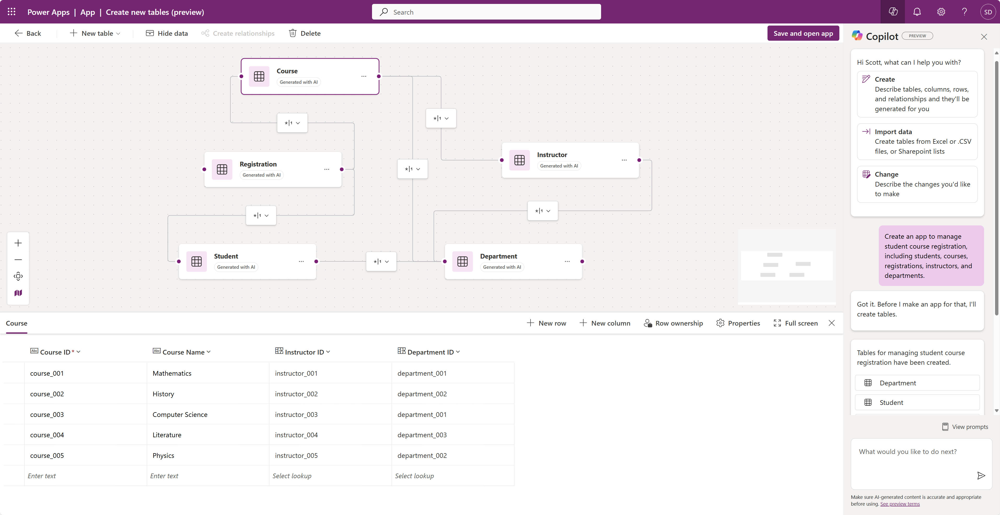

# Course Registration

This Power Apps prompt helps you create a course registration app.

## Description

This prompt helps you create a course registration app that allows users to register for courses. It uses the new Power Apps Copilot data experience to help you build a multi-table, multi-screen app.

## Prompt

Create an app to manage student course registration, including students, courses, registrations, instructors, and departments.

### Supported Language(s)

[English](./en-us/prompt.md)

## Authors

Solution|Author(s)
--------|---------
Course Registration | [scottdurow](https://www.github.com/scottdurow) ([@scottdurow](https://twitter.com/scottdurow)), Microsoft

## Minimal Path to Awesome

* Copy the prompt
* Paste prompt into the new data experience inside Power Apps

## Disclaimer

**THIS CODE IS PROVIDED *AS IS* WITHOUT WARRANTY OF ANY KIND, EITHER EXPRESS OR IMPLIED, INCLUDING ANY IMPLIED WARRANTIES OF FITNESS FOR A PARTICULAR PURPOSE, MERCHANTABILITY, OR NON-INFRINGEMENT.**

