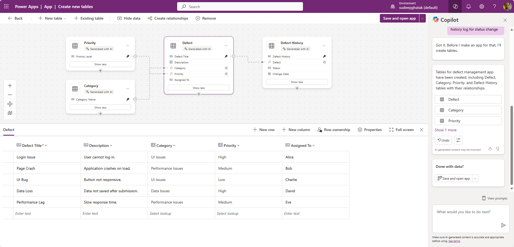

# Defect Management 

This Power Apps prompt helps you create a defect tracking app.

## Description

This prompt helps you create a course registration app that help teams monitor and resolve defects systematically. It includes categorisation capabilities to organise defects by type or other relevant categories, assign priority levels to each defect, include a field for a JIRA Work Item number and track team member is responsible for addressing each defect. It uses the new Power Apps Copilot data experience to help you build a multi-table, multi-screen app.

## Prompt

Develop a defect management app to efficiently track and resolve defects. Include defect categorisation, priority setting, and JIRA Work Item integration. Ensure fields for assigned resources and maintain detailed defect history log for status changes and resolutions.

### Supported Language(s)

[English](./en-us/prompt.md)

## Authors

Solution|Author(s)
--------|---------
Defect Management | [Sudeep Ghatak](https://www.github.com/sudeepghatak) [LinkedIn](https://www.linkedin.com/in/sudeepghatak/)

## Minimal Path to Awesome

* Copy the prompt
* Paste prompt into the new data experience inside Power Apps

## Disclaimer

**THIS CODE IS PROVIDED *AS IS* WITHOUT WARRANTY OF ANY KIND, EITHER EXPRESS OR IMPLIED, INCLUDING ANY IMPLIED WARRANTIES OF FITNESS FOR A PARTICULAR PURPOSE, MERCHANTABILITY, OR NON-INFRINGEMENT.**

