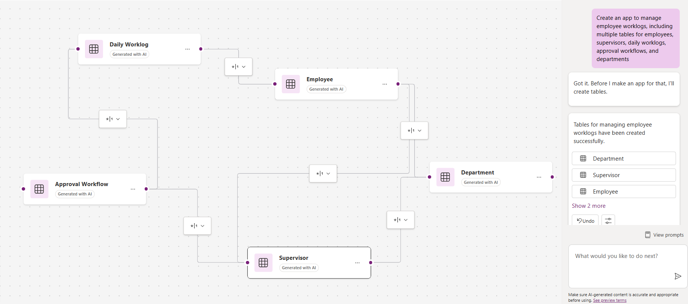

# Employee Worklog Management App

## Description

This prompt helps create an app to manage employee worklogs, including multiple tables for employees, supervisors, daily worklogs, approval workflows, and departments.

## Prompt
Create an app to manage employee worklogs, including multiple tables for employees, supervisors, daily worklogs, approval workflows, and departments.

### Supported Language(s)

[English](./en-us/prompt.md)

## Authors

Solution|Author(s)
--------|---------
Employee Worklog Management App | [Summit Bajracharya](https://www.github.com/summitbaj) ([@summitbaj](https://twitter.com/imsumit)), Signetic

## Minimal Path to Awesome

* Copy the prompt
* Paste prompt into the Power Apps Co-pilot

## Disclaimer

**THIS CODE IS PROVIDED *AS IS* WITHOUT WARRANTY OF ANY KIND, EITHER EXPRESS OR IMPLIED, INCLUDING ANY IMPLIED WARRANTIES OF FITNESS FOR A PARTICULAR PURPOSE, MERCHANTABILITY, OR NON-INFRINGEMENT.**

