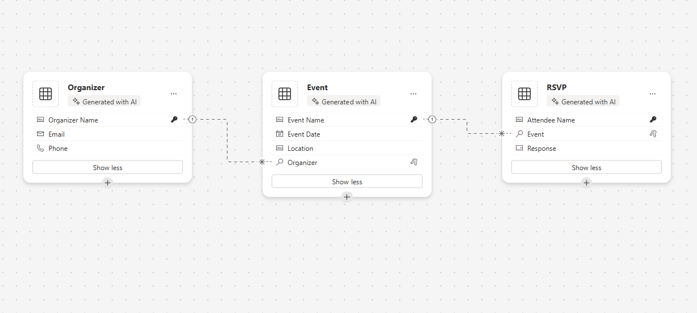

# Event & RSVP Manager App

## Description

This prompt helps create an app to manage events and RSVPs. The app allows users to add event details such as name, date, location, and organizer information. Users can view events, send RSVP invitations, and track attendee responses, enabling efficient event organization and attendee management.

## Prompt

Create an app for managing events and RSVPs. Users can add event details such as name, date, location, and organizer information, view events, and send RSVP invitations. Track attendee responses.

### Supported Language(s)

[English](./en-us/prompt.md)

## Authors

| Solution                 | Author(s)                                                                                                                      |
| ------------------------ | ------------------------------------------------------------------------------------------------------------------------------ |
| Event & RSVP Manager App | [Summit Bajracharya](https://www.github.com/summitbaj) ([@SummitBajracharya](https://twitter.com/SummitBajracharya)), Signetic |

## Minimal Path to Awesome

1. Copy the prompt.
2. Paste the prompt into Power Apps Co-pilot.
3. Generate the app and customize it as needed.

## Disclaimer

**THIS CODE IS PROVIDED _AS IS_ WITHOUT WARRANTY OF ANY KIND, EITHER EXPRESS OR IMPLIED, INCLUDING ANY IMPLIED WARRANTIES OF FITNESS FOR A PARTICULAR PURPOSE, MERCHANTABILITY, OR NON-INFRINGEMENT.**

