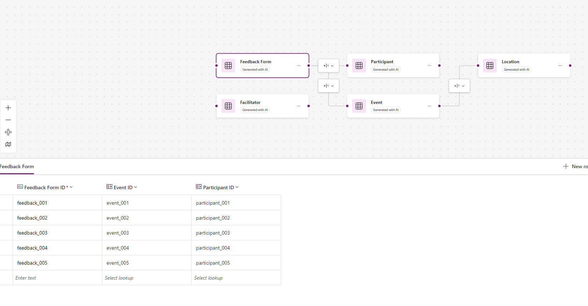

# Course Registration

This Power Apps prompt helps you create an app to manage team-building activities, where participants are linked to events, locations, facilitators, and feedback forms.

## Description

This prompt helps you create an app to manage team-building activities. The app will allow you to manage participants, events, locations, facilitators, and feedback forms. Participants can be linked to events, locations, facilitators, and feedback forms. The app will help you keep track of all the information related to team-building activities.

## Prompt

Build an app to manage team-building activities, where participants are linked to events, locations, facilitators, and feedback forms.

### Supported Language(s)

[English](./en-us/prompt.md)

## Authors

Solution|Author(s)
--------|---------
Team building activities | [ValerasNarbutas](https://github.com/ValerasNarbutas) ([@ValerasNarbutas](https://twitter.com/ValerasNarbutas))

## Minimal Path to Awesome

* Copy the prompt
* Paste prompt into the new data experience inside Power Apps

## Disclaimer

**THIS CODE IS PROVIDED *AS IS* WITHOUT WARRANTY OF ANY KIND, EITHER EXPRESS OR IMPLIED, INCLUDING ANY IMPLIED WARRANTIES OF FITNESS FOR A PARTICULAR PURPOSE, MERCHANTABILITY, OR NON-INFRINGEMENT.**

